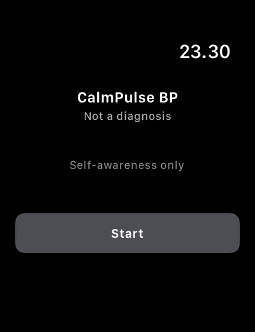
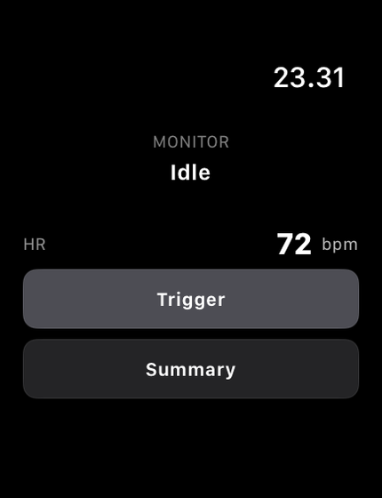
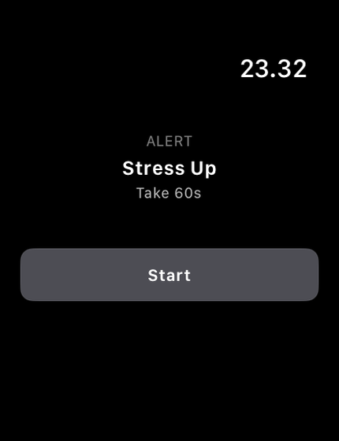
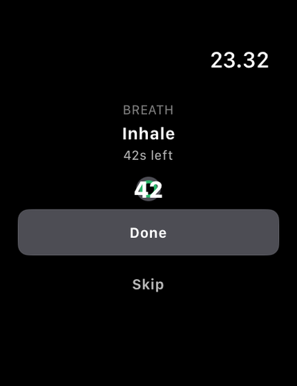
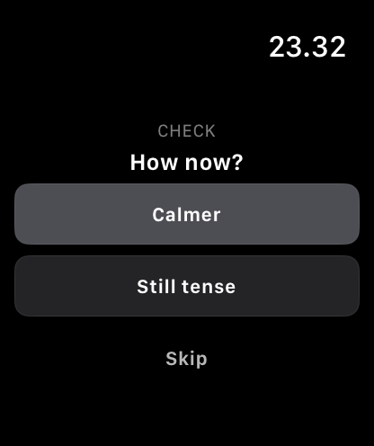
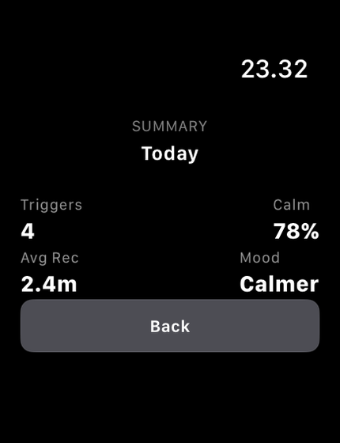

# CalmPulse BP (Apple Watch)

CalmPulse BP is a watch-first behavioral companion for young adults with hypertension. It helps users notice stress signals, run short guided breathing, and reflect after each session to build a repeatable self-regulation habit.

> **Medical Safety Notice**
> CalmPulse BP is **not a diagnostic tool**, **not an emergency service**, and **does not replace professional medical care**.

## Project Snapshot
- **Type:** watchOS-first accessibility and behavior-support MVP
- **Primary user:** young adults with hypertension in daily study/work routines
- **Current status:** scaffold + runtime-dynamic MVP flow
- **Core behavior:** state-driven intervention flow with session-based summary metrics
- **Scope boundary:** behavioral support only, not clinical diagnosis

## Core User Flow
1. **Onboarding** — user acknowledges safety and product positioning.
2. **Idle Monitoring** — app waits in low-friction mode.
3. **Triggered** — user receives a prompt to pause.
4. **Breathing Active** — short guided breathing (target: 60 seconds).
5. **Reflection Pending** — user records post-session mood.
6. **Summary** — app shows live metrics derived from recorded sessions.

Detailed transition rules: `docs/STATE_MACHINE.md`

## Current MVP Capabilities
- watchOS-first SwiftUI app scaffold with six routed states
- runtime session logging through trigger → breathing/skip → reflection → summary
- summary metrics derived from in-app session data (not hardcoded demo values)
- reflection result captured into session mood outcome
- breathing phase countdown with inhale/exhale state handling
- empty-state handling when no session exists yet

## Known Limitations
- no persistent storage across app relaunch yet
- no real HealthKit ingestion pipeline yet
- trigger behavior is still heuristic/non-clinical
- no iPhone companion sync in current MVP
- no emergency escalation integration

## Testing Status
- Functional validation is currently performed on **watchOS Simulator only**.
- Physical Apple Watch testing has **not** been completed yet.
- Current outcomes should be interpreted as **Scaffold/MVP-stage validation**.

## App Screenshots
<p align="center">
  
  
  
</p>
<p align="center">
  
  
  
</p>

> Screenshots represent the current simulator-based MVP state.

## Architecture & Docs
### Layered Architecture
- **App** — app entry point and root state routing
- **Features** — screen/state-specific UI modules
- **Domain** — app states, trigger/mood contracts, and session model
- **Infrastructure** — state model, flow orchestration, timer/haptic adapters
- **Resources/UI** — theme tokens and reusable components

### Domain Notes
- `Domain/AppState.swift` defines the six app states.
- `Domain/AppConfig.swift` defines runtime defaults:
  - `hrThresholdDelta`: `14`
  - `cooldownMinutes`: `45`
  - `breathingDurationSeconds`: `60`
- `Domain/SessionLogEntry.swift` includes:
  - `timestamp`
  - `triggerReason`
  - `sessionCompleted`
  - `moodAfter`
  - `recoveryDurationSeconds`
  - `optionalBP` (nullable, planned for v1.1)

### Key Documentation
- Product requirements: `docs/PRD.md`
- State transitions: `docs/STATE_MACHINE.md`
- Technical roadmap: `docs/TECH_PLAN.md`
- Safety/compliance notes: `docs/COMPLIANCE_NOTES.md`
- Accessibility baseline: `docs/ACCESSIBILITY_BASELINE.md`
- UI style guide: `docs/UI_STYLE_GUIDE.md`
- Haptic choreography: `docs/HAPTIC_CHOREOGRAPHY.md`
- UI QA checklist: `docs/UI_QA_CHECKLIST.md`

## Local Run
### Prerequisites
- macOS with latest stable Xcode
- watchOS runtime installed (`Xcode > Settings > Platforms`)
- Apple ID configured in Xcode for signing (if deploying to physical watch)

### Setup
```bash
cd calmpulse-bp-apple
open CalmPulseBP.xcodeproj
```

### Run on Simulator
1. Choose a watchOS simulator target.
2. Build and run from Xcode.
3. Navigate through the six core app states.
